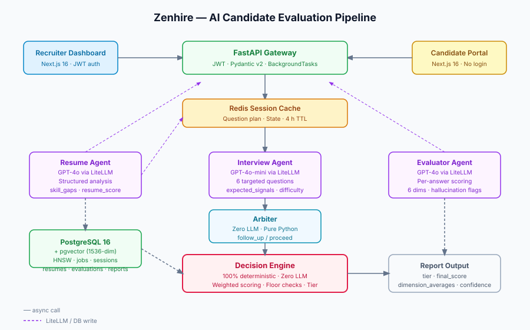

# Zenhire — AI Candidate Evaluation System

> End-to-end AI pipeline that evaluates software engineering candidates using three specialised agents, a deterministic decision engine, and a fully explainable scoring rubric.


---

## 🚀 Live Demo

| Service | URL |
|---|---|
| Recruiter Dashboard | https://frontend-tau-three-77.vercel.app |
| API | https://zenhire-api.onrender.com |
| API Docs | https://zenhire-api.onrender.com/docs |
| Candidate Interview | https://frontend-tau-three-77.vercel.app/interview/{session_id} |

---

## What This Is

Zenhire is a portfolio-grade AI candidate evaluation system that automates the technical interview process from resume upload through to a hiring decision. A recruiter creates a job with a custom evaluation rubric, invites a candidate via a unique link, and receives a fully explainable hiring report — without the candidate needing to create an account.

The system uses three LLM agents orchestrated through a session state machine. The Resume Agent (GPT-4o) parses and scores the uploaded PDF against the job requirements. The Interview Agent (GPT-4o-mini) generates six targeted technical questions with expected signal keywords, adjusted for skill gaps found in the resume. The Evaluator Agent (GPT-4o) grades each answer across six dimensions in a background task so the candidate is never blocked waiting.

The architectural highlight is the **Decision Engine** — a zero-LLM, zero-async, 100% deterministic Python class that ingests all six evaluation records and produces the final hiring decision. This separation is intentional: it guarantees auditability, makes scoring reproducible, and lets hiring teams customise the rubric weights without touching prompt engineering.

---

## Architecture



The system is built in four layers:

| Layer | Technology | Role |
|---|---|---|
| **API Gateway** | FastAPI 0.110, Pydantic v2 | Route handling, JWT auth, BackgroundTasks |
| **Session Cache** | Redis 7 | Question plan, answer state, 4-hour TTL |
| **Agent Orchestrator** | LangGraph 0.2, LiteLLM | Resume → Interview → Evaluate pipeline |
| **Persistent Store** | PostgreSQL 16 + pgvector | Jobs, sessions, resumes, evaluations, reports |

---

## Three Agents

| Agent | Model (default) | Latency | Responsibility |
|---|---|---|---|
| **Resume Agent** | GPT-4o / claude-sonnet-4-6 | ~3 s | Parses PDF, identifies skill gaps, returns structured JSON with `resume_score` (0–10) and `skill_gaps[]` |
| **Interview Agent** | GPT-4o-mini / llama-3.1-8b | ~2 s | Generates 6 targeted questions with `expected_signals[]` and difficulty ratings based on job + resume analysis |
| **Evaluator Agent** | GPT-4o / claude-sonnet-4-6 | ~4 s/answer | Runs asynchronously in background; scores each answer on 6 dimensions; flags hallucinations |

All LLM calls route through **LiteLLM Router** (`app/services/ai_router.py`), which provides automatic cross-provider fallback. The actual model used depends on which API keys are configured (see LLM Providers section below).

---

## LLM Providers

Zenhire supports four LLM providers with automatic fallback via LiteLLM Router.
Set any combination of keys in your `.env` file:

| Provider | Smart Model | Fast Model | Free Tier |
|---|---|---|---|
| OpenAI | gpt-4o | gpt-4o-mini | No |
| Anthropic | claude-sonnet-4-6 | claude-haiku-4-5 | No |
| Groq | llama-3.3-70b-versatile | llama-3.1-8b-instant | **Yes ✓** |
| OpenRouter | claude-sonnet-4-6 | gemma-3-27b-it | **Yes ✓** |

**Minimum setup:** Set at least one key. For resume embeddings, `OPENAI_API_KEY` is always required (Groq and OpenRouter do not offer embedding APIs).

**Recommended for zero cost:** Set `GROQ_API_KEY` (free) + `OPENAI_API_KEY` (for embeddings only — very cheap at ~$0.0001/resume).

Check which providers are active at runtime:

```bash
curl http://localhost:8000/health/providers
# {"openai": true, "groq": true, "anthropic": false, "openrouter": false, "active_count": 2, ...}
```

---

## The Decision Engine

The Decision Engine (`app/engine/decision.py`) is the most important file in the project and uses **zero LLM calls**. This is a deliberate architectural decision:

> *LLMs are probabilistic. A hiring decision that can silently change between two API calls, or hallucinate a different tier for the same candidate on consecutive runs, is legally and ethically unacceptable. The Decision Engine is a pure function: same inputs, same output, forever. It can be unit-tested exhaustively, its logic can be explained to a hiring manager in plain English, and its weights can be audited by legal or HR without touching a prompt.*

### Scoring Formula

```
dimension_averages  = mean of each dimension across all 6 evaluations
weighted_sum        = Σ (dimension_avg[d] × weight[d])   for d in 6 dimensions
penalty             = Σ hallucination penalties  (capped at −2.0)
interview_score     = clamp(weighted_sum + penalty, 0, 10)
final_score         = interview_score × 0.80 + resume_score × 0.20
                      (or × 1.0 if no resume score available)
```

### Tier Thresholds

| Tier | Condition |
|---|---|
| `strong_hire` | `final_score ≥ 8.5` |
| `hire` | `7.0 ≤ final_score < 8.5` |
| `maybe` | `5.5 ≤ final_score < 7.0` |
| `reject` | `final_score < 5.5` **or** any floor violation |

### Floor Overrides

If any dimension average falls below its floor threshold, the tier is forced to `reject` regardless of the weighted score:

| Dimension | Floor |
|---|---|
| `technical_accuracy` | 5.0 |
| `problem_solving` | 4.5 |
| `communication_clarity` | 4.0 |
| `depth_of_explanation` | 4.0 |
| `relevance` | 3.5 |
| `reasoning_quality` | 3.5 |

---

## Evaluation Rubric

| Dimension | Default Weight | Floor | What It Measures |
|---|---|---|---|
| `technical_accuracy` | 0.25 | 5.0 | Correctness of facts, algorithms, and terminology |
| `problem_solving` | 0.25 | 4.5 | Structured decomposition, trade-off reasoning |
| `communication_clarity` | 0.15 | 4.0 | Clear, well-structured explanations |
| `depth_of_explanation` | 0.15 | 4.0 | Goes beyond surface-level, covers edge cases |
| `relevance` | 0.10 | 3.5 | Stays on-topic, addresses the actual question |
| `reasoning_quality` | 0.10 | 3.5 | Logical flow, justification of decisions |

Recruiters can customise weights per job posting. The engine normalises weights to sum to 1.0.

---

## Hallucination Detection

The Evaluator Agent flags three types of answer integrity issues:

| Flag | Penalty | Description |
|---|---|---|
| `technical_falsehood` | −0.8 | Stated something factually incorrect as fact |
| `shallow_reasoning` | −0.3 | Gave confident-sounding but empty answer |
| `experience_bluff` | −0.5 | Claimed experience that contradicts the resume |

Penalties are summed and capped at −2.0. If ≥2 answers carry `experience_bluff`, an additional −0.3 bluff-carry penalty applies.

---

## Design Decisions

### 1. Why the Decision Engine uses zero LLM calls

LLM outputs are non-deterministic: the same prompt can return different tier classifications on consecutive calls. A hiring decision that changes between runs creates legal liability (inconsistent treatment of candidates) and makes the system unauditable. The Decision Engine is a pure Python function — same inputs, same output, every run. Its entire logic fits in one file, can be unit-tested exhaustively, and can be explained to HR or legal without a single prompt.

### 2. Why three agents instead of one

Each agent has a distinct latency profile and knowledge requirement. The Resume Agent needs the full PDF context and job description. The Interview Agent needs the structured output from the Resume Agent. The Evaluator Agent needs one answer at a time and runs in the background. Splitting them allows the Interview Agent to use a cheaper model (GPT-4o-mini, ~$0.0002/answer) while the Resume and Evaluator Agents use GPT-4o where accuracy matters most. Combining them into one agent would require a single model to hold all context simultaneously, increase cost, and make the prompt fragile.

### 3. Why pgvector instead of Qdrant

This system does not need a standalone vector database. The resume embedding (1536 dimensions) is written once per candidate and queried once to compute job-fit score. pgvector with an HNSW index handles this at negligible overhead with no additional infrastructure service, no separate API, and no synchronisation lag between the relational and vector layers. Qdrant would be appropriate if the system needed approximate-nearest-neighbour search across millions of candidates.

### 4. Why LangGraph checkpointing is not used

LangGraph checkpointing persists intermediate agent state automatically to a database. This makes the control flow implicit and harder to reason about — a hiring system needs an explicit, inspectable audit trail. Every state transition in Zenhire is an explicit DB write (`evaluations`, `sessions`, `reports` tables), which means any state can be reconstructed from SQL alone, without understanding LangGraph internals. This also avoids schema migrations tied to LangGraph's internal checkpoint format.

### 5. Why hallucinations have three specific types

General "hallucination detected" flags are not actionable for a hiring manager. The three types map to distinct candidate behaviours with different severity: a technical falsehood (−0.8) suggests the candidate doesn't know the domain; an experience bluff (−0.5) suggests resume padding; shallow reasoning (−0.3) suggests coaching rather than genuine understanding. The penalties are calibrated so that a single minor shallow-reasoning flag doesn't disqualify a strong candidate, but multiple integrity issues compound to materially lower the final score.

---

## Quick Start (Local)

**Prerequisites:** Docker, Docker Compose, an OpenAI API key.

```bash
# 1. Clone the repository
git clone https://github.com/your-username/zenhire.git
cd zenhire

# 2. Set up environment variables
cp .env.production.example backend/.env
# Fill in: OPENAI_API_KEY, JWT_SECRET_KEY, POSTGRES_PASSWORD

# 3. Start all services
docker compose up -d

# 4. Run database migrations
cd backend && poetry run alembic upgrade head

# 5. Open the recruiter dashboard
open http://localhost:3000
```

**Candidate interview link format:** `http://localhost:3000/interview/{session_id}`

---

## API Reference

| Method | Path | Auth | Description |
|---|---|---|---|
| `GET` | `/health` | — | Service health check |
| `POST` | `/auth/register` | — | Create recruiter account |
| `POST` | `/auth/login` | — | Get JWT token |
| `POST` | `/jobs` | JWT | Create job with rubric weights |
| `GET` | `/jobs` | JWT | List recruiter's jobs |
| `POST` | `/sessions/invite` | JWT | Generate candidate invite link |
| `POST` | `/resumes/upload` | — | Candidate uploads PDF resume |
| `POST` | `/sessions/{id}/start` | — | Trigger Resume + Interview agents |
| `GET` | `/sessions/{id}/question` | — | Get current interview question |
| `POST` | `/sessions/{id}/answer` | — | Submit answer; Arbiter decides next step |
| `GET` | `/sessions/{id}/evaluation-status` | JWT | Poll background evaluation progress |
| `POST` | `/sessions/{id}/evaluate` | JWT | Run Decision Engine → persist report |
| `GET` | `/sessions/{id}/report` | JWT | Fetch cached hiring report |

---

## Tech Stack

| Backend | Frontend |
|---|---|
| Python 3.12 | Next.js 16 (App Router) |
| FastAPI 0.110 | TypeScript strict |
| SQLAlchemy 2.0 async | Tailwind CSS v4 |
| Alembic | shadcn/ui (Radix) |
| LangGraph 0.2 | TanStack Query v5 |
| LiteLLM | Zustand v5 |
| pgvector (HNSW index) | Recharts v3 |
| Redis asyncio | Lucide React |
| python-jose (JWT) | |
| pdfplumber | |

---

## Running Tests

```bash
# Backend unit tests (Decision Engine: 5 tests)
cd backend && poetry run pytest tests/unit/ -v

# Backend linter
cd backend && poetry run ruff check app/

# Frontend TypeScript check + build
cd frontend && npm run build
```

---

## What I Would Add in Production

- **Rate limiting** on candidate endpoints (prevent scraping of questions)
- **Email delivery** of candidate invite links via SendGrid
- **Async resume processing** via a proper job queue (Redis Queue or Celery) instead of synchronous processing in the request lifecycle — the current `sessions.start()` blocks for ~5s
- **Candidate re-attempt policy** — currently a session is one-shot; production would allow a controlled retry window
- **Multi-tenant recruiter organisations** with team-level job sharing
- **Webhook callbacks** when evaluations complete so the recruiter UI doesn't need to poll
- **GDPR compliance** — candidate data retention policy, right-to-erasure endpoint, anonymisation of evaluations after 90 days
- **Prometheus metrics** on agent latency and LLM token spend per session

---

## Resume Bullet Point

> *Built Zenhire, an end-to-end AI candidate evaluation system using FastAPI, LangGraph, and three GPT-4o agents (Resume, Interview, Evaluator); implemented a 100% deterministic Python Decision Engine with a 6-dimension scoring rubric, floor enforcement, and typed hallucination detection; delivered a full Next.js recruiter dashboard and candidate interview portal with PostgreSQL + pgvector, Redis session caching, JWT auth, and a clean shadcn/ui component library — full stack from PDF upload to explainable hiring decision in under 60 seconds.*

---

## License

MIT
